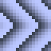

# **PixelEffect** ✨

Pixel-perfect animated path effect.

- 📦 <http://henrysoftware.itch.io/godot-pixel-effect>
- 🌐 <http://rakkarage.github.io/PixelEffect>
- 📃 <http://guthub.com/rakkarage/PixelEffect>

## Installation

To use a repository with submodules, like this one:

- Use the `--recurse-submodules` option.

      git clone --recurse-submodules http://guthub.com/rakkarage/PixelEffect

- Or use `git submodule init` and `git submodule update`.

---

